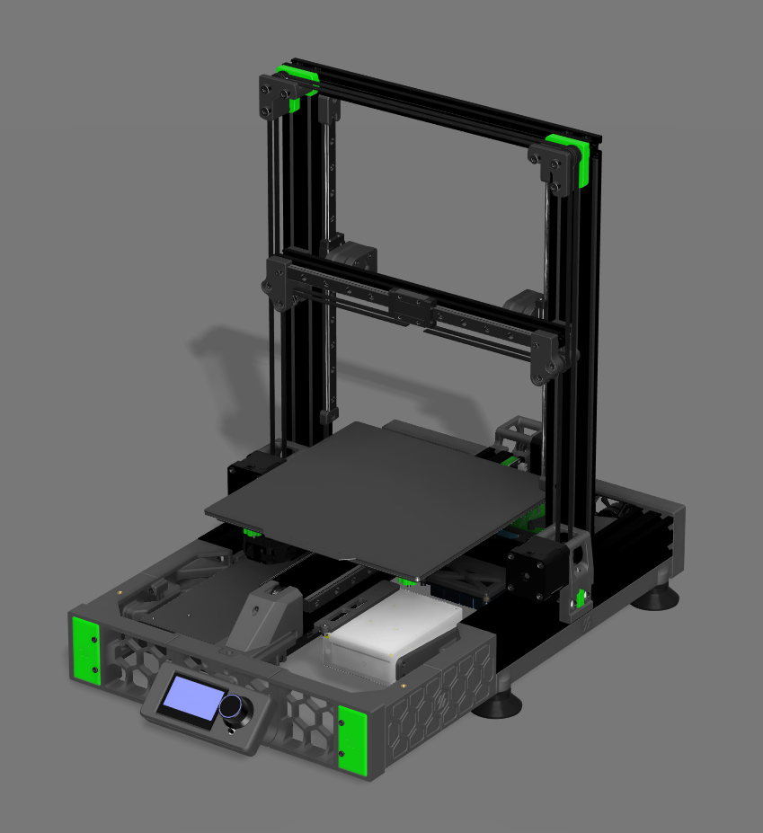
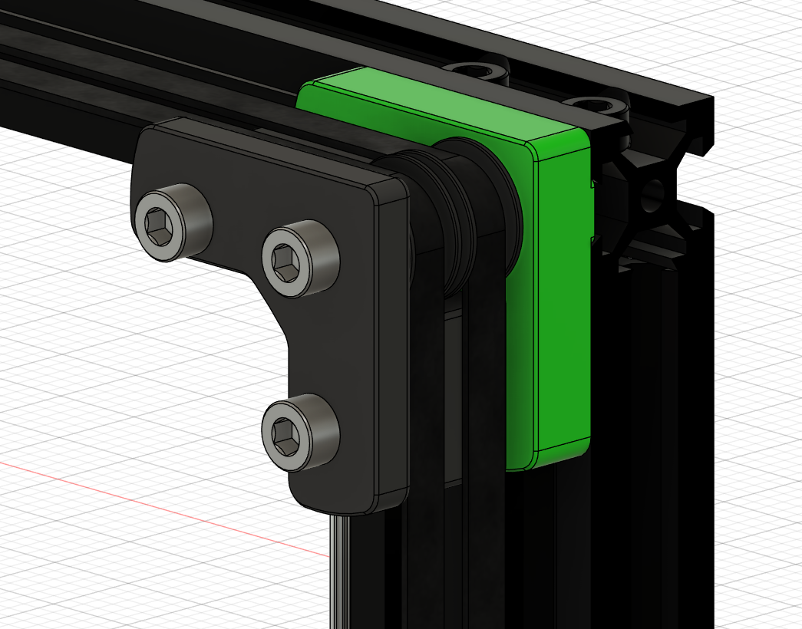

# Ender 3 Pro - VSW (Work in progress)

This is a conversion based on the original [Ender 3 Pro Switchwire](https://github.com/boubounokefalos/Ender_SW).

The Ender 3 Pro was my first printer with which I started my 3D printing adventure. There were good beginnings and some that are better not talked about, but only a miracle saved this printer from flying off the balcony. However, it is my only printer, so I couldn't let my emotions get carried away, after all there weren't that many problems with it.

After a few years I decided to 'squeeze' as much as I could out of this machine. Inspired by other modifications and the Voron series, I decided to do it myself, but a little differently. Everyone has different needs and everyone sees different improvements they can make. I want to show my vision for improving this popular budget printer.

This is how this project came about.
I hope you enjoy reading this and maybe you will like one of my ideas and use it.
The description will be mainly divided into two parts: main modifications and side modifications.

#### Main modifications:
The biggest change, will be the design of 2 versions of the hotend:
- [ ] Bowden system,
- [ ] Direct system.

and cooling of the workpiece with air from outside the chamber:
- [ ] Redesigning the chamber.

and other quite important modifications:
- [x] Replacing the toothless GT2 pulley with a gear wheel,
- [ ] Redesigning a BLTouch mount in place of the original Switchwire levelling.

#### Side modifications:
- [x] Change of Rasppery Pi mount for version 4 model B,
- [x] BIGTREETECH BTT SKR Mini E3 model change from v2.0 to v3.0,
- [x] Additional four supports in the middle of the table,
- [x] Additional table insulation,
- [ ] Removal of the cable chain for the Z axis.

In the future, I also plan to modify the hotend mount to make it compatible with, for example, the E3D V6, etc.

## Directory structure
| Directory            | Description                                                                        |
|----------------------|------------------------------------------------------------------------------------|
| CAD/                 | Design files in Fusion 360                                                         |
| STEP/                | Design files in STEP format                                                        |
| STL/                 | Design files in STL format                                                         |
| Images/              | Photo of the project in Fusion 360 and the real one after the project is finished  |

## Main modifications
### Replacing the toothless GT2 pulley with a gear wheel
A pulley without teeth can deform the belt teeth, which can cause inaccuracies in the hotend's movement in the XYZ axes. The best solution is to use a pulley with teeth matched to a suitable belt, in my case a GT2 belt.

The gears I purchased were larger in diameter than the previous ones, so it was not without modifications to other components in close contact to avoid collisions.

#### Y-axis pulley
| Before                                   | After                                  |
|:----------------------------------------:|:--------------------------------------:|
|||

#### X-axis pulleys

For the wheels mounted on the X-axle, only one wheel was changed and, in addition, the aluminium profile had to be slightly trimmed at a 45-degree angle. This is necessary to avoid collisions, as well as reworking more components to hold the GT2 belt vertically and horizontally.
The second pulley remained unchanged, as the belt will rotate on it with the side without teeth.

The left side of the X axis is made analogous to the right side.

| Before                                   | After                                  |
|:----------------------------------------:|:--------------------------------------:|
|||

#### Y-axis pulleys

| Before                                   | After                                  |
|:----------------------------------------:|:--------------------------------------:|
|||

## Side modifications

### Change of Rasppery Pi mount for version 4 model B
Modifying the attachment of the Rasppery Pi 4 to the aluminium profiles gave more mounting options. In addition, the whole structure has been reinforced, as the previous one was not very flexible in my opinion.
| Before                         | After                        |
|:------------------------------:|:----------------------------:|
|||

### BIGTREETECH SKR Mini E3 model change from v2.0 to v3.0,
The BTT SKR Mini E3 v3.0 mount has also been reinforced.
| Before                                     | After                                    |
|:------------------------------------------:|:----------------------------------------:|
|||

### Additional four table supports
Four supports in the central area under the table will improve stability and reduce the likelihood of the table warping due to temperature increases.
| Cross-section                                   | Assembling                                    |
|:-----------------------------------------------:|:---------------------------------------------:|
|||

### Additional table insulation
The additional insulation of the table will prevent the heat from underneath being transferred to the surroundings more quickly and will certainly reduce the energy consumption to maintain the temperature.
|:-----------------------------------------------:|
||