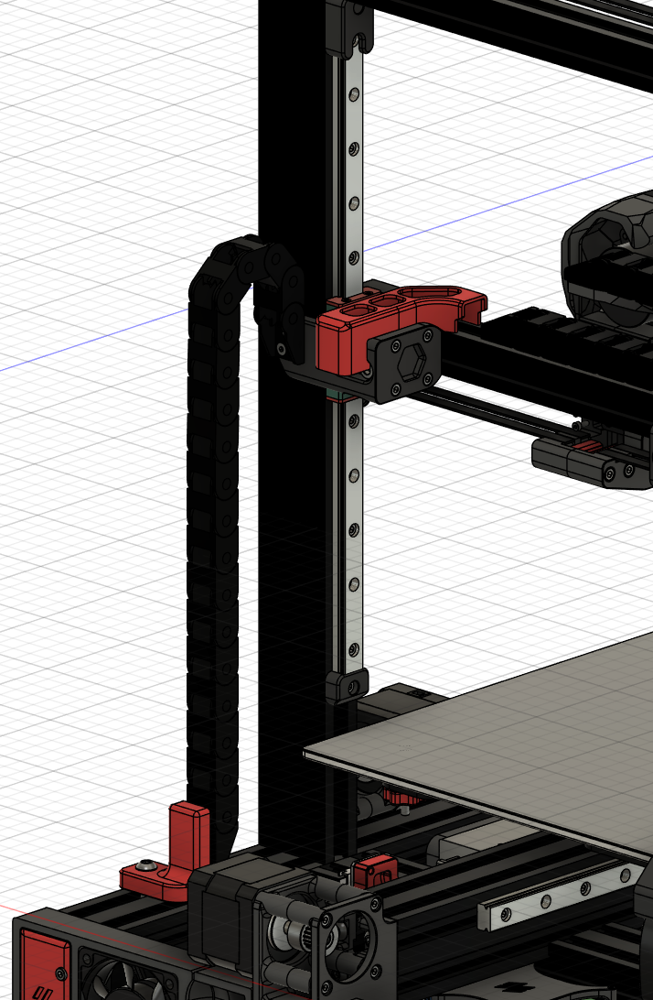
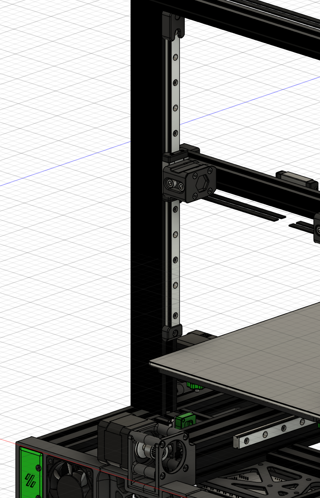
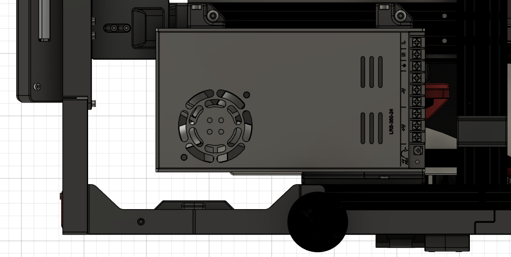
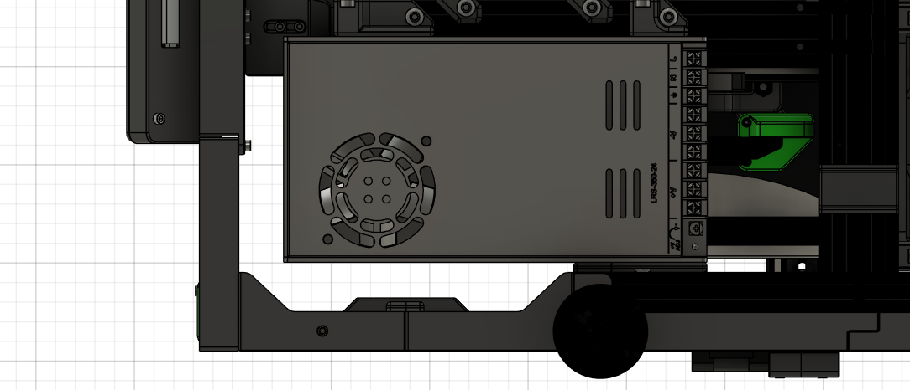
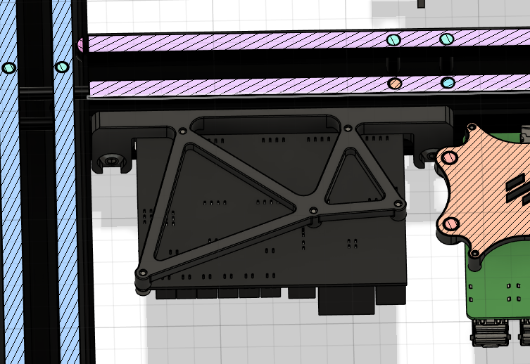
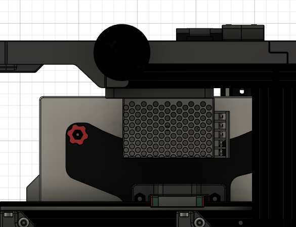
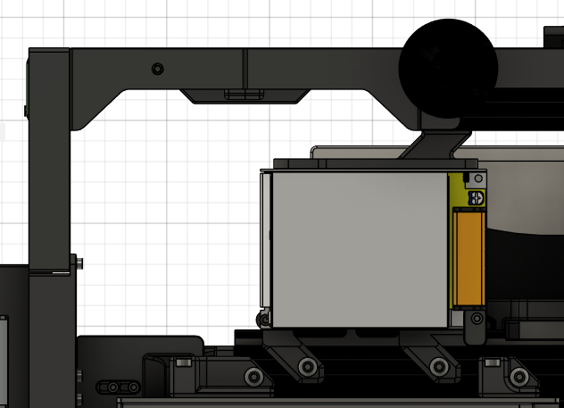
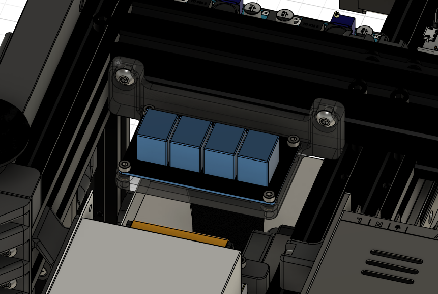
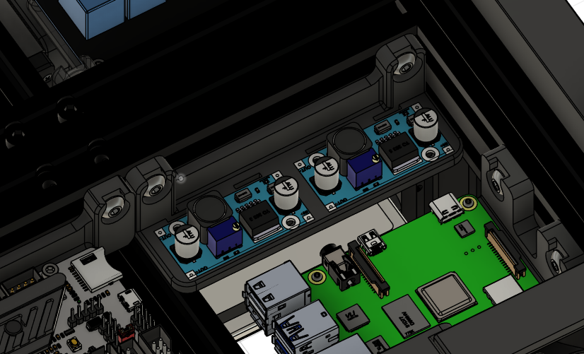

# Ender 3 Pro - VSW Conversion (Work in Progress)

This project is a custom conversion based on the original [Ender 3 Pro Switchwire](https://github.com/boubounokefalos/Ender_SW).

The Ender 3 Pro was my first 3D printer, marking the start of my journey in 3D printing. After a few years, I decided to push this machine to its limits. Drawing inspiration from other modification projects and the Voron series, I set out to make my own modifications. Everyone has different needs and ideas for improvement, and this project represents my personal take on enhancing this popular budget printer.

This is how the project came to life. I hope you enjoy reading about it, and perhaps you'll find some of my ideas useful for your own projects.

The modifications are grouped into two categories: <b>Main Modifications</b> and <b>Side Modifications</b>.

#### Main modifications:
The major changes focus on two designs for the hotend:
- [ ] Bowden system
- [ ] Direct system

Additionally, there are modifications for workpiece cooling using air from outside the chamber:
- [ ] Redesigned chamber for improved airflow

Other significant upgrades include:
- [x] Replacing the smooth GT2 pulley with a geared pulley
- [ ] Redesigning the BLTouch mount to replace the original Switchwire leveling system

#### Side modifications:
- [x] Upgraded Raspberry Pi mount for version 4 Model B
- [x] Upgraded BIGTREETECH BTT SKR Mini E3 from v2.0 to v3.0
- [x] Added four additional supports under the bed
- [x] Added insulation to the bed for better heat retention
- [x] Removed the cable chain for the Z-axis
- [x] Redesigned mount for the 24V power supply
- [x] Redesigned mount for the SKR Mini E3 v3.0
- [x] Redesigned mount for the 12V power supply
- [x] Designed mount for the relays
- [x] Designed mount for the buck converters

#### Future Plans:
In the future, I plan to modify the hotend mount to make it compatible with other popular hotends, such as the E3D V6.

## Directory structure
| Directory            | Description                                                                        |
|----------------------|------------------------------------------------------------------------------------|
| CAD/                 | Design files in Fusion 360                                                         |
| STEP/                | Design files in STEP format                                                        |
| STL/                 | Design files in STL format                                                         |
| Images/              | Photo of the project in Fusion 360 and the real one after the project is finished  |

## Main modifications
### Replacing the toothless GT2 pulley with a gear wheel
The original smooth pulley can cause the belt teeth to deform, leading to inaccuracies in the hotend's movement along the XYZ axes. To resolve this, I've switched to a geared pulley that matches the GT2 belt.

However, the new pulleys are larger in diameter, necessitating modifications to nearby components to avoid collisions.

#### Y-axis pulley
For the Y-axis pulley, I'm considering upgrading to a wider belt and a more powerful stepper motor if any accuracy issues arise at higher speeds. These changes would provide greater stability and torque, ensuring consistent precision even during faster movements.
| Before                                   | After                                  |
|:----------------------------------------:|:--------------------------------------:|
|||

#### X-axis pulleys
For the X-axis, I replaced one of the pulleys and had to trim the aluminum profile at a 45-degree angle to prevent collisions. The second pulley remained unchanged since the belt rotates on the smooth side.

| Before                                   | After                                  |
|:----------------------------------------:|:--------------------------------------:|
|||

#### Z-axis pulleys
The Z-axis pulley mount was redesigned to minimize the downward force along the Z-axis, which could cause the mount to bend over time. This change improves the overall stability and longevity of the assembly, ensuring more accurate movements and reducing wear.
| Before                                   | After                                  |
|:----------------------------------------:|:--------------------------------------:|
|||

## Side modifications

### Change of Rasppery Pi mount for version 4 model B
By redesigning the Raspberry Pi 4 mount to attach to the aluminum frame, I've increased the mounting flexibility and reinforced the overall structure.
| Before                         | After                        |
|:------------------------------:|:----------------------------:|
|||

### BIGTREETECH SKR Mini E3 model change from v2.0 to v3.0,
The mount for the SKR Mini E3 v3.0 has also been reinforced for added stability.
| Before                                     | After                                    |
|:------------------------------------------:|:----------------------------------------:|
|||

### Additional four table supports
To improve stability and minimize warping from heat, I added four supports beneath the bed.
| Cross-section                                   | Assembling                                    |
|:-----------------------------------------------:|:---------------------------------------------:|
|||

### Additional table insulation
Adding insulation beneath the bed will help retain heat and reduce energy consumption during printing.
|                                             |
|:-------------------------------------------:|
||

### Removed the cable chain for the Z-axis
The X-axis cable guide and cable chain are no longer necessary. 
Instead, the cables will be supported by the cooling supply tubes that run from outside the chamber, exiting through the rear wall of the enclosure. 
This simplifies cable management and enhances the overall design by reducing unnecessary components.
| Before                                                      | After                                                   |
|:-----------------------------------------------------------:|:-------------------------------------------------------:|
|||

### Redesigned mount for the 24V power supply
The 24V power supply mount has been redesigned and relocated to the front of the printer, providing additional space for better cable management and reducing clutter.
| Before                                             | After                                          |
|:--------------------------------------------------:|:----------------------------------------------:|
|||

### Redesigned mount for the SKR Mini E3 v3.0
The SKR Mini E3 mount has been redesigned to address the fragility of the original mount, which easily bent when connecting additional components to the board. The new design ensures greater durability and stability during assembly.
| Before                                              | After                                           |
|:---------------------------------------------------:|:-----------------------------------------------:|
|||

### Redesigned mount for the 12V power supply
A new mount has been designed for the 12V power supply, which will power LED lighting and future components requiring 12V. Although the original 24V power supply could be used, its current capacity may not be enough for future expansions. The mount has also been repositioned toward the front of the printer to create additional space for other components.
| Before                                             | After                                          |
|:--------------------------------------------------:|:----------------------------------------------:|
|||

### Designed mount for the relays
A mount was designed for a 4-channel relay module to switch the SKR Mini E3 board, LED lighting, electronics cooling fan, and chamber heating. This circuit is controlled by the Raspberry Pi. In the future, if more channels are required, a redesign may be necessary to accommodate additional relays.
|                                   |
|:---------------------------------:|
||

### Designed mount for the buck converters
A mount has been designed for two buck converters to step down the power supply for various components. One converter will be dedicated to powering the Raspberry Pi 4, while the second will be reserved for future use, providing flexibility for additional components as needed.
|                                            |
|:------------------------------------------:|
||